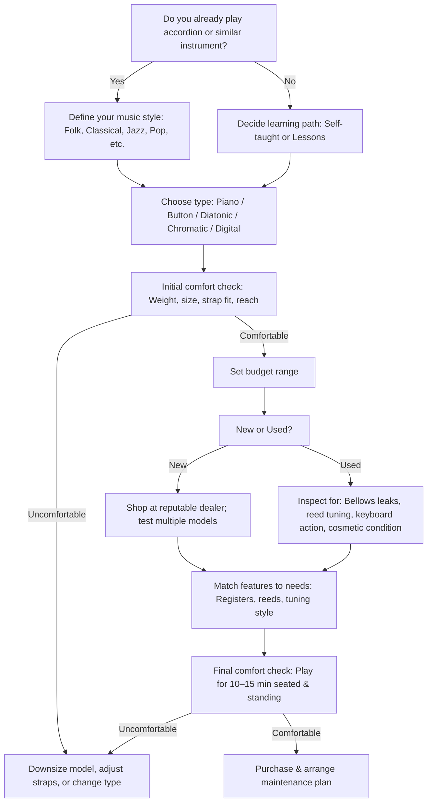

<!-- UNISYS_IMPORT_RECORD
AUID: MIG-00028
TSN: TSN-20260403-MIGRATE
Class: DOC
Lifecycle: Active
Title: Accordion Decision Flowchart
CreatedBy: Kyle Breneman
OriginalRepo: displacedalarm9/kabreneman.us
OriginalPath: 2025-11-25_accordion-decision-flowchart.md
OriginalLocation: github:displacedalarm9/kabreneman.us/2025-11-25_accordion-decision-flowchart.md
MigratedOn: 2026-04-03
-->
